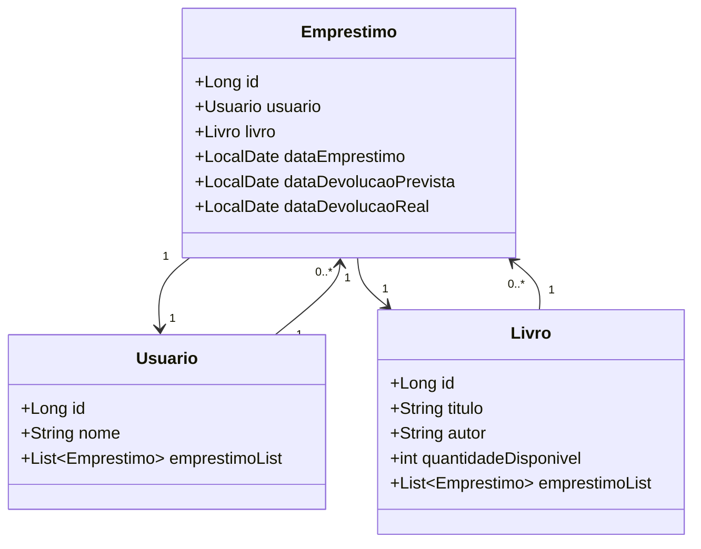

# API de estudos Biblioteca 
Criando uma API simples de biblioteca seguindo as boas práticas de programação.

## Diagrama de Classes

```mermaid
classDiagram
    class Emprestimo {
        +Long id
        +Usuario usuario
        +Livro livro
        +LocalDate dataEmprestimo
        +LocalDate dataDevolucaoPrevista
        +LocalDate dataDevolucaoReal
    }

    class Livro {
        +Long id
        +String titulo
        +String autor
        +int quantidadeDisponivel
        +List~Emprestimo~ emprestimoList
    }

    class Usuario {
        +Long id
        +String nome
        +List~Emprestimo~ emprestimoList
    }

    Emprestimo "1" --> "1" Usuario 
    Emprestimo "1" --> "1" Livro 
    Livro "1" --> "0..*" Emprestimo 
    Usuario "1" --> "0..*" Emprestimo
```
